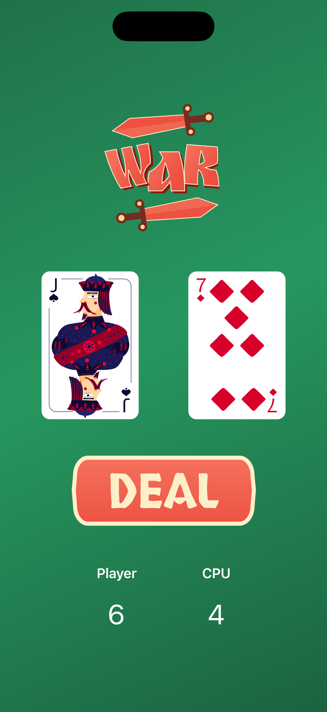

# War Card
A very simple card dealing game built with SwiftUI. 

Only two cards are randomly dealt at a time, a **player** card and a **CPU** card. The card with higher value wins and one point is awarded to 
the winner. In case of a draw, no point is awarded. That's it.

## SwiftUI Views

The following views are used in creating the UI of the app:
- ZStack
- VStack
- HStack
- Image
- Button

## SwiftUI Modifiers
The following modifiers are used:
- resizable()
- ignoresSafeArea()
- padding()
- foregroundStyle(_:)
- font(_:)

## Swift & Miscellaneous 
The following extra concepts are used to make the app logic work:
- @State
- variables (**var**)
- constants (**let**)
- functions (**func**)

Above views, modifiers and concepts are the entirety of this simple app.

# App Preview

