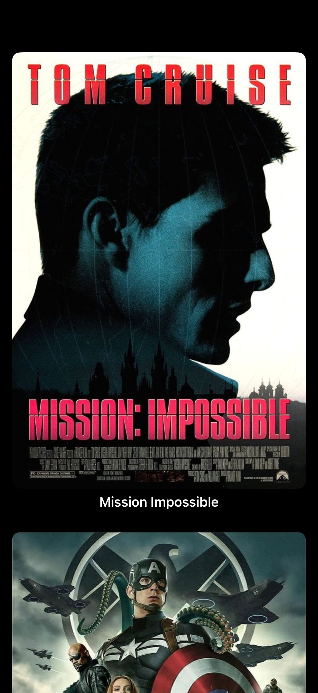

# Movie List
A simple challenge to test your understanding of the basics of List (SwiftUI) and Structures (Swift). 

## Setup
Image assets can be found [here](https://www.dropbox.com/scl/fi/igscbbrvbc0jur4rcg0bj/Foundations-Module-2-Challenge-1-Assets.zip?rlkey=mm2xbz7rjhl08z1ic5ephyaa9&dl=1).

## Challenge
- Build a UI that lets you scroll through a list of movie posters
- Each movie poster should have a label under it
- Background of the app should be black
- Create a "DataService" struct to serve the data (just like we did with the SushiMenu App)

## Goal
Display a scrollable list of movie posters.

## Solution
Solution can be found [here](https://www.dropbox.com/scl/fi/h341j8mtbu6cgmz70eppj/Foundations-Module-2-Challenge-1-Project.zip?rlkey=tvqawanul0bnzpks4s2bhfy19&dl=1).

You can check the solution and this app code to see if they do the exact same thing.

# Screenshots

