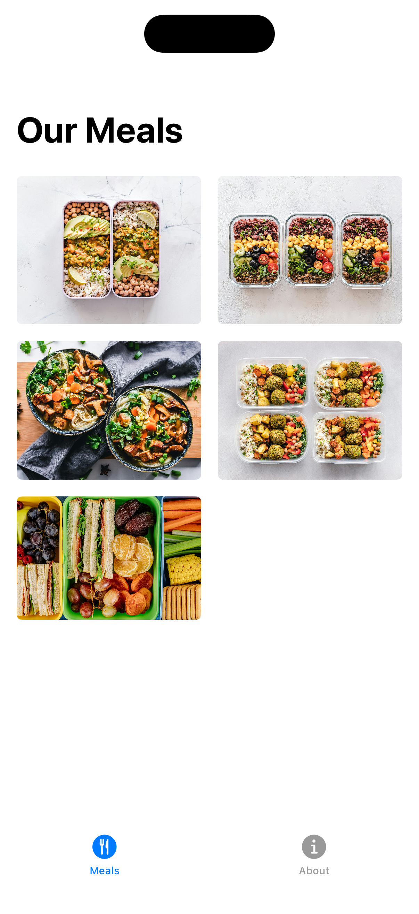
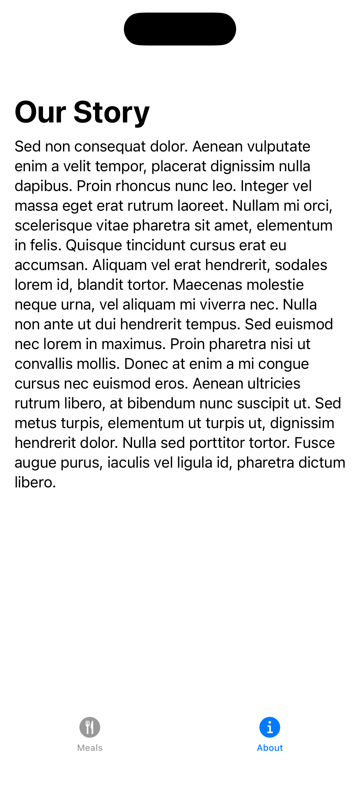

# Meal Delivery
A simple challenge to test your understanding of the basics of TabView, LazyVGrid and ScrollView. 

## Setup
Image assets can be found [here](https://www.dropbox.com/scl/fi/wwolm5mbj9oh624b2flnr/Foundations-Module-3-Challenge-1-Assets.zip?rlkey=cm559xg0qel4mkh1t8ge73kr4&dl=1).

## Challenge
- Build a tabbed app where the first tab is a list of meals and the second tab is about the company.
- In the first tab, display the images of the meals in a two column grid. The left/right margins and spacing between items should be the same.
- In the second tab, display a scrollable block of text.
- Represent each tab in the tab bar with an icon and label.

## Goal
Provide tabbed navigation between two views.

## Solution
Solution can be found [here](https://www.dropbox.com/scl/fi/3qf7035khh03jlxtqqtw8/Foundations-Module-3-Challenge-1-Project.zip?rlkey=lnoixxa2yw3w3tkbl1nkml15g&dl=1).

You can check the solution and this app code to see if they do the exact same thing.

# Screenshots
  
