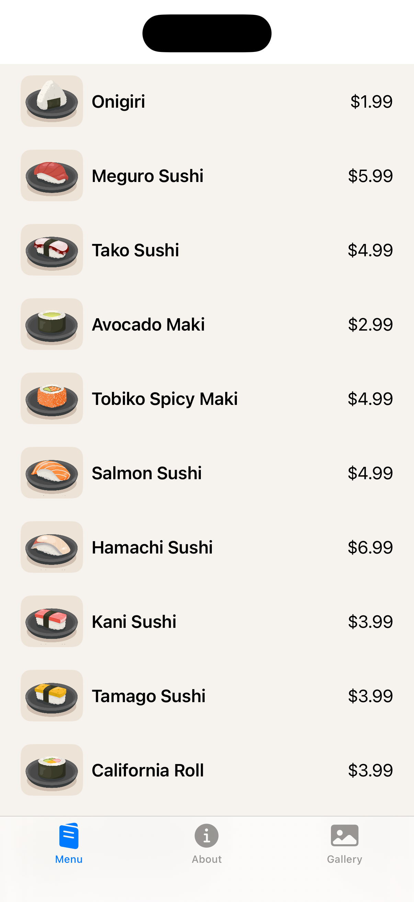
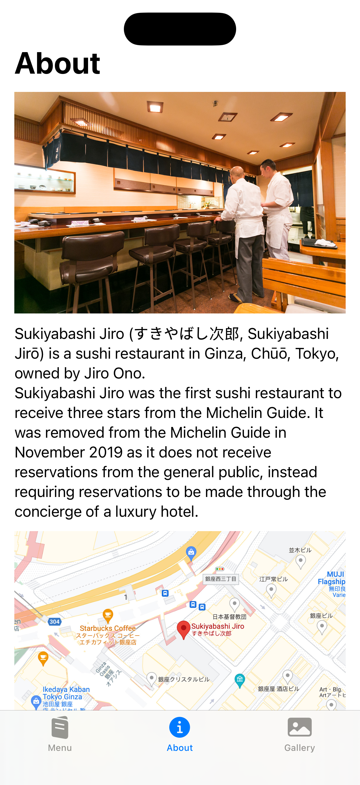
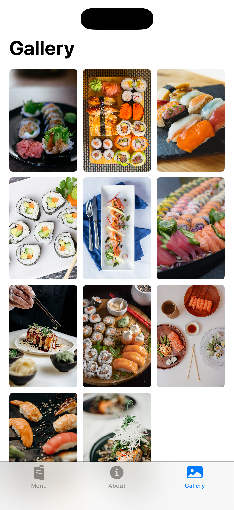

# Restaurant App
A very simple app that displays a list of sushi dishes. 

## SwiftUI Views

The following views are used in creating the UI of the app:
- TabView
- Label
- ScrollView
- VStack
- HStack
- ZStack
- Text
- Image
- GeometryReader
- LazyVGrid
- ForEach
- List
- Button
- Spacer()

## SwiftUI Modifiers
The following modifiers are used:
- tabItem(:)
- resizable()
- aspectRatio(contentMode:)
- font(_:)
- frame(height:)
- frame(maxWidth:maxHeight:alignment:)
- listRowSeparator(:)
- listRowBackground(:)
- listStyle(:)
- onAppear(perform:)
- padding()
- bold()
- scrollIndicators(:)
- clipShape(:)
- onTapGesture(perform:)
- sheet(isPresented:content:)
- scaleEffect(:)

## Swift & Miscellaneous 
The following extra concepts are used to make the app logic work:
- @State
- @Binding
- @Environment(\.dismiss)
- Variables (**var**)
- Constants (**let**)
- Functions (**func**)
- Structures (**struct**)
- Data service
- Arrays
- Multiline String

Above views, modifiers and concepts are the entirety of this simple app.

# Screenshots
  
