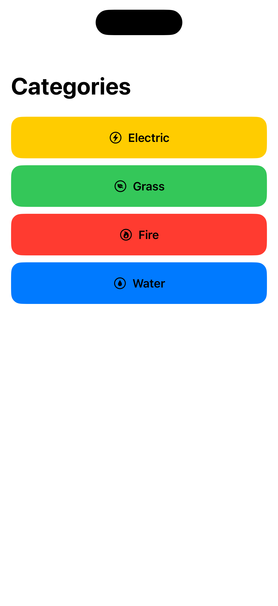
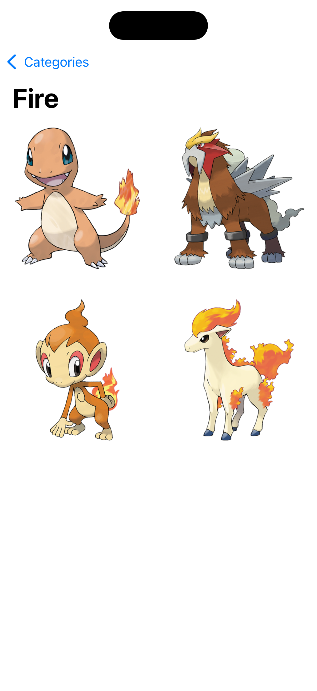
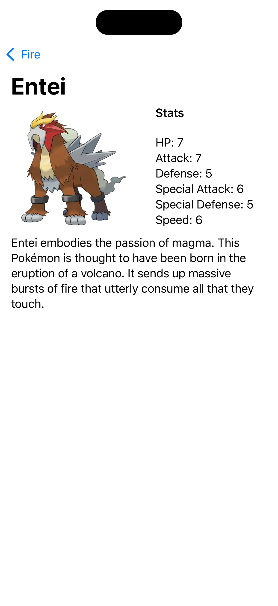

# Pokemon App
A simple Pokemons explorer app to test your understanding of the basics of NavigationView, NavigationLink and working with JSON data. 

## Setup
- Image assets can be found [here](https://www.dropbox.com/scl/fi/j2vqy9ce4idjp5zvl62nf/Foundations-Module-4-Challenge-1-Assets.zip?rlkey=2sa1teht113z0rp5h1h292etu&dl=1).
- JSON data file can be found [here](https://www.dropbox.com/scl/fi/lemwbvto1o05vg13egb4o/Foundations-Module-4-Challenge-1-Data-File.zip?rlkey=0jbyc4ue96etzaq43utqedru7&dl=1).

## Challenge
- Build a UI that lets you scroll through a list of Pokemon types on the first screen.
- Each Pokemon type should be represented by text, a relevant icon and a relevant background color.
- When the user selects a type, drill down to display a two column grid of images representing the Pokemon of this type. The margins and space between items should be consistent.
- When the user selects a Pokemon, drill down to display the details of the Pokemon.

## Goal
The goal is to be able to:
- Load JSON data from a file.
- Decode JSON data into Swift models.
- Provide drilled down navigation between views (**NavigationStack**).

## Solution
Solution can be found [here](https://www.dropbox.com/scl/fi/s8lyb3twnur228cjhbhu5/Foundations-Module-4-Challenge-1-Project.zip?rlkey=w0yjnqnsky4j3srtx70mkrofu&dl=1).

You can check the solution and this app code to see if they do the exact same thing.

# Screenshots
    
