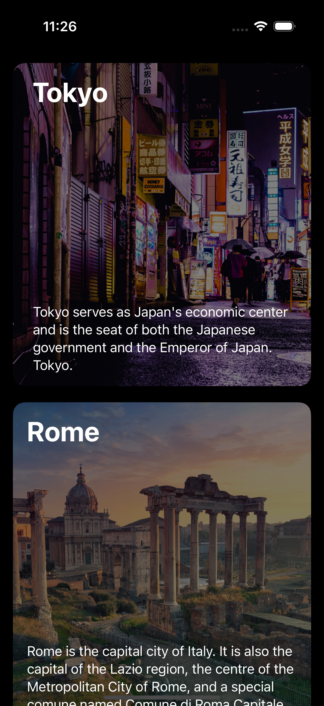
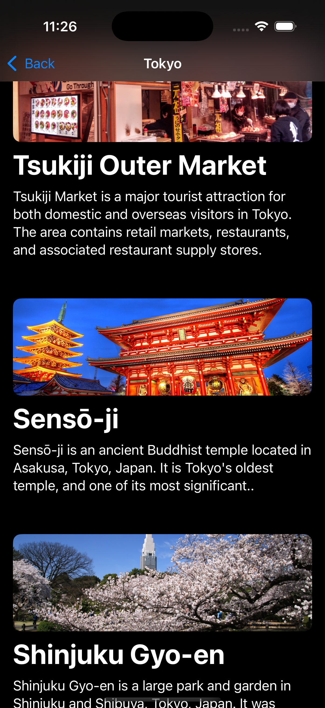

# Guidebook App
A very simple app that displays a list of attractions for you to visit. 

## SwiftUI Views

The following views are used in creating the UI of the app:
- NavigationStack
- ScrollView
- VStack
- ZStack
- ForEach
- NavigationLink(destination:label:)
- Rectangle
- RoundedRectangle(cornerRadius:)
- Image
- Spacer

## SwiftUI Modifiers
The following modifiers are used:
- preferredColorScheme(:)
- padding()
- scrollIndicators(:)
- ignoresSafeArea()
- onAppear(perform:)
- background(content:)
- resizable()
- aspectRatio(contentMode:)
- foregroundStyle(:)
- clipShape(:)
- opacity(:)
- font(:)
- bold()
- multilineTextAlignment(:)
- frame(height:)
- navigationTitle(:)
- navigationBarTitleDisplayMode(.inline)
- overlay(alignment:content:)

## Swift & Miscellaneous 
The following extra concepts are used to make the app logic work:
- @State
- Structures (**struct**)
- Data service
- Arrays
- Replace characters in a String
- JSON data format
- Decode JSON into Swift types (**Codable**)
- Catch errors (**do-catch**)
- Call throwable methods/functions (**try**)
- Remove diacritics from String (**String.folding(options: .diacriticInsensitive, locale: Locale.current)**)

Above views, modifiers and concepts are the entirety of this simple app.

# Screenshots
        
